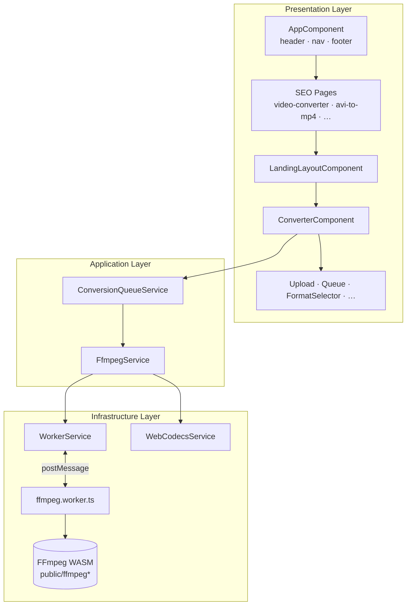
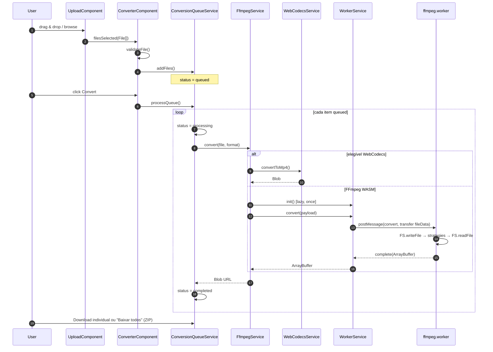
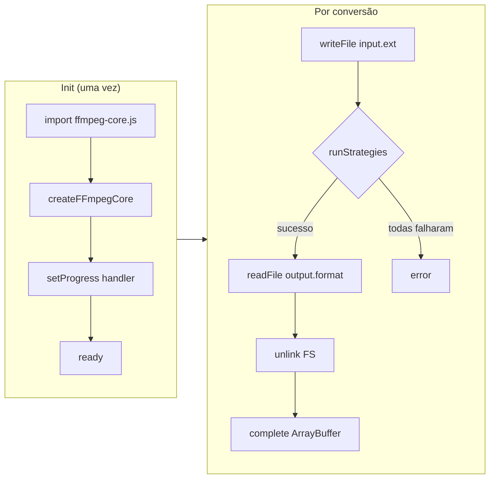
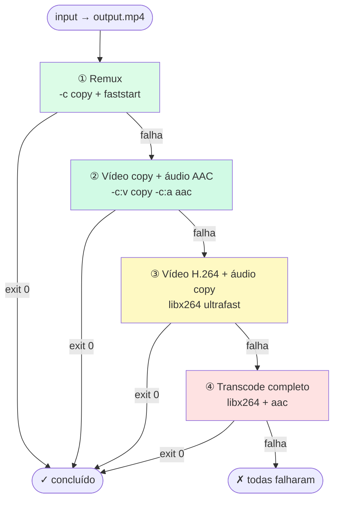
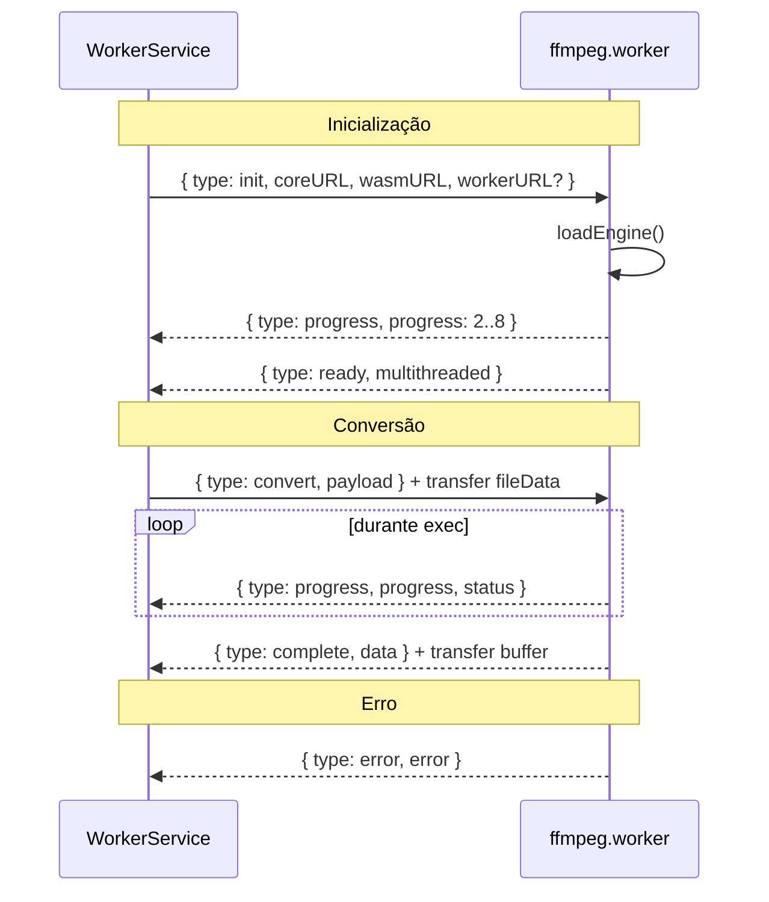
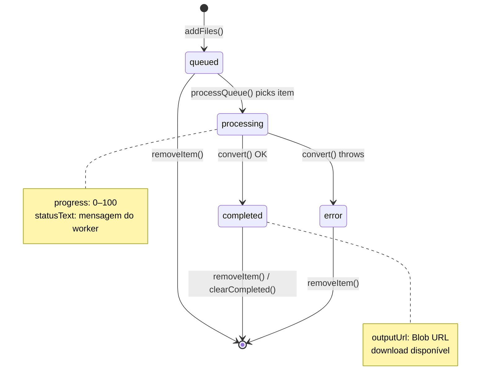
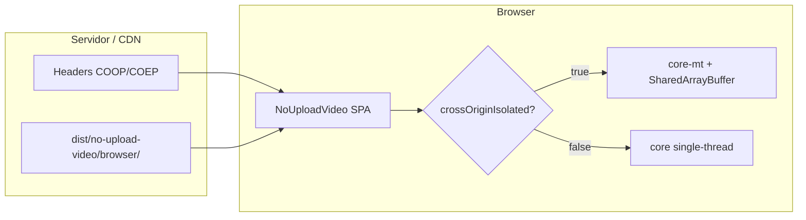
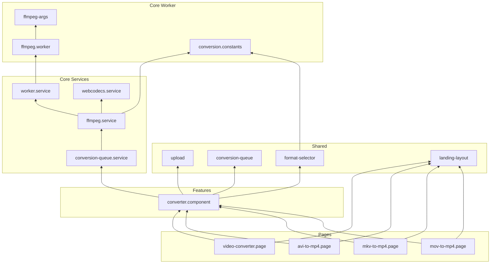

# NoUploadVideo — Arquitetura

Documento visual da arquitetura do projeto. Para referência detalhada de APIs e configuração, veja [DOCUMENTATION.md](DOCUMENTATION.md).

---

## Índice

1. [Visão em camadas](#1-visão-em-camadas)
2. [Fluxo de dados](#2-fluxo-de-dados)
3. [Pipeline FFmpeg no Worker](#3-pipeline-ffmpeg-no-worker)
4. [Estratégias de conversão](#4-estratégias-de-conversão)
5. [Comunicação Worker ↔ Main Thread](#5-comunicação-worker--main-thread)
6. [Estado da fila](#6-estado-da-fila)
7. [Decisão de motor de conversão](#7-decisão-de-motor-de-conversão)
8. [Deploy e isolamento de origem](#8-deploy-e-isolamento-de-origem)
9. [Mapa de dependências](#9-mapa-de-dependências)

---

## 1. Visão em camadas



### Responsabilidades por camada

```
┌────────────────────────────────────────────────────────────┐
│  FEATURES + SHARED                                          │
│  • Renderização, acessibilidade, UX                         │
│  • Validação de arquivo (tamanho, extensão)                 │
│  • Orquestração da fila na UI                               │
└────────────────────────────┬───────────────────────────────┘
                             │
┌────────────────────────────▼───────────────────────────────┐
│  CORE — Services                                            │
│  • ConversionQueueService: estado da fila (signals)        │
│  • FfmpegService: API pública de conversão                  │
│  • WorkerService: lifecycle do Web Worker                   │
│  • WebCodecsService: fast path opcional                     │
└────────────────────────────┬───────────────────────────────┘
                             │
┌────────────────────────────▼───────────────────────────────┐
│  CORE — Worker + Utils                                      │
│  • ffmpeg.worker.ts: execução FFmpeg off-thread             │
│  • ffmpeg-args.ts: estratégias de linha de comando          │
│  • Assets WASM servidos de public/ffmpeg*                   │
└────────────────────────────────────────────────────────────┘
```

---

## 2. Fluxo de dados

### Do upload ao download



### Transferência de memória

```
Main Thread                          Web Worker
─────────────                          ──────────
File.arrayBuffer()
       │
       ▼
postMessage({ fileData }, [fileData]) ──►  Uint8Array no MEMFS
       │                                      │
       │ (transfer: sem cópia)               ▼
       │                                 ffmpeg exec
       │                                      │
       ◄── postMessage({ data }, [data]) ────┘
       │
       ▼
new Blob([data]) → URL.createObjectURL()
```

---

## 3. Pipeline FFmpeg no Worker



### Fases de progresso

```
Progresso (%)
100 ┤                                          ████ Done
 98 ┤                                    ████ read output
 97 ┤                              ████████ encode phase
 15 ┤                         ████
 14 ┤                    ████ strategy attempts
 10 ┤               ████ start conversion
  9 ┤          ████ write file
  8 ┤     ████ engine ready
  2 ┤ ████ loading engine
  0 ┴──────────────────────────────────────────────────► tempo
```

---

## 4. Estratégias de conversão

### Saída MP4 (cascata)



### Velocidade vs compatibilidade

```
Mais rápido ◄────────────────────────────────────► Mais compatível

  remux          vídeo copy        vídeo transcode      full transcode
  (-c copy)      + áudio AAC       + áudio copy         (vídeo + áudio)
     │                │                  │                    │
     ▼                ▼                  ▼                    ▼
  segundos         segundos~min       minutos              minutos+
```

---

## 5. Comunicação Worker ↔ Main Thread



### Tipos de mensagem

| Direção | type | Quando |
|---------|------|--------|
| → Worker | `init` | Primeira conversão (lazy load) |
| → Worker | `convert` | Cada arquivo |
| ← Worker | `ready` | Engine carregado |
| ← Worker | `progress` | Setup ou encode |
| ← Worker | `complete` | Sucesso |
| ← Worker | `error` | Falha |

---

## 6. Estado da fila



### Processamento sequencial

```
Fila: [ A.avi, B.mkv, C.mp4, D.mov ]
                │
                ▼
         ┌─────────────┐
         │ Processa A  │ ──► completed
         └─────────────┘
                │
                ▼
         ┌─────────────┐
         │ Processa B  │ ──► completed
         └─────────────┘
                │
               ...
```

> Um arquivo por vez evita múltiplas cópias de 200 MB na memória WASM.

---

## 7. Decisão de motor de conversão

```mermaid
flowchart TD
    IN([convert file, format]) --> WC_CHECK{WebCodecs<br/>elegível?}

    WC_CHECK -->|mp4/webm → mp4<br/>+ API disponível| WC_TRY[WebCodecsService.convertToMp4]
    WC_CHECK -->|não| FF[WorkerService + FFmpeg]

    WC_TRY -->|sucesso| OUT([Blob URL])
    WC_TRY -->|falha| FF

    FF --> MT{crossOriginIsolated<br/>+ SharedArrayBuffer?}
    MT -->|sim| MT_CORE[/ffmpeg-mt/ multi-thread]
    MT -->|não| ST_CORE[/ffmpeg/ single-thread]

    MT_CORE --> OUT
    ST_CORE --> OUT
```

### Matriz de elegibilidade WebCodecs

| Entrada | Saída | Motor |
|---------|-------|-------|
| MP4 | MP4 | WebCodecs → FFmpeg fallback |
| WebM | MP4 | WebCodecs → FFmpeg fallback |
| AVI | MP4 | FFmpeg apenas |
| MKV | MP4 | FFmpeg apenas |
| MOV | MP4 | FFmpeg apenas |
| qualquer | MP3 | FFmpeg apenas |
| qualquer | AVI/MKV/MOV | FFmpeg apenas |

---

## 8. Deploy e isolamento de origem



### Headers necessários

```
Request ──► CDN/Server
                │
                ├── Cross-Origin-Opener-Policy: same-origin
                ├── Cross-Origin-Embedder-Policy: require-corp
                │
                ▼
         crossOriginIsolated = true
                │
                ▼
         FFmpeg multi-thread ativo
```

---

## 9. Mapa de dependências



### Regra de dependência

```
features  →  shared  →  core
   │                      │
   └──────────────────────┘  (features pode usar core diretamente)

core/workers  →  core/utils, core/models  (nunca importa Angular)
```

---

## Referências

- [Documentação completa](DOCUMENTATION.md)
- [Guia de contribuição e novos formatos](CONTRIBUTING.md)
