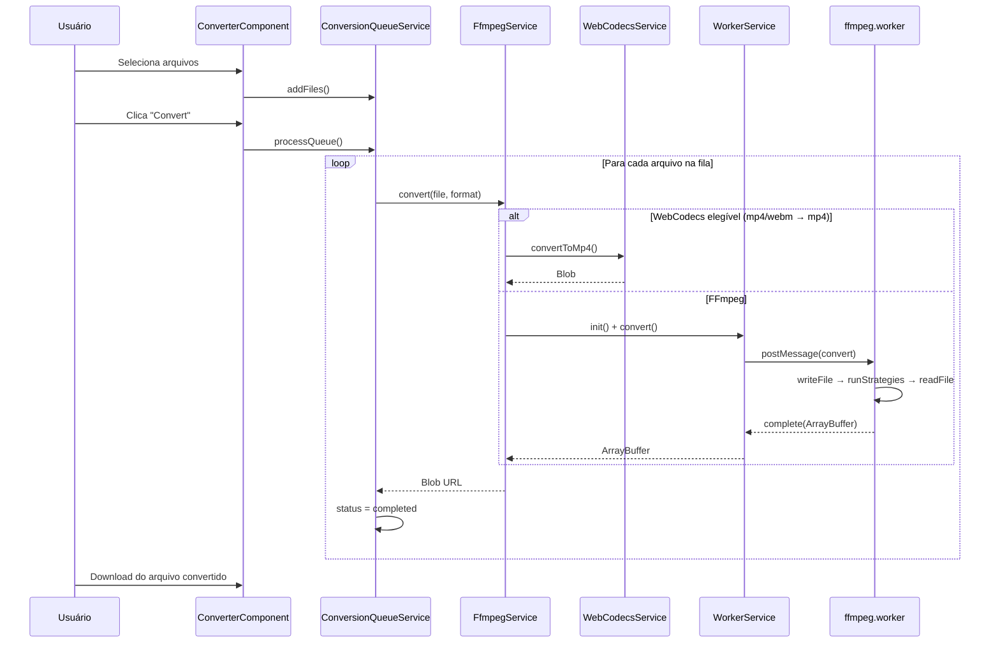
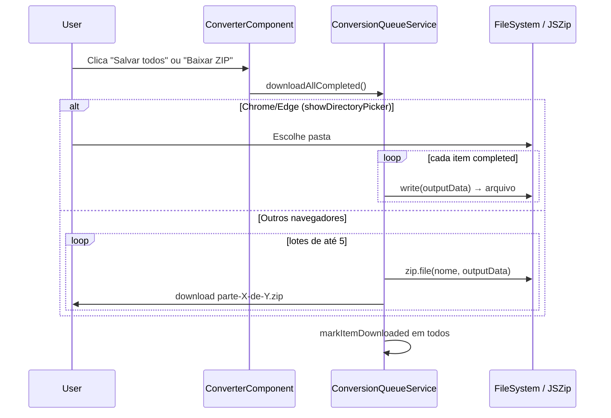

# NoUploadVideo — Documentação Completa

Conversor de vídeo 100% no navegador, sem upload para servidor. Todo o processamento ocorre localmente via **FFmpeg WebAssembly**, com suporte opcional a **WebCodecs** e **multi-thread**.

---

## Documentos relacionados

| Documento | Conteúdo |
|-----------|----------|
| [ARCHITECTURE.md](ARCHITECTURE.md) | Diagramas visuais (camadas, fluxos, estados) |
| [ROADMAP.md](ROADMAP.md) | O que foi feito e o que falta (workmap) |
| [CONTRIBUTING.md](CONTRIBUTING.md) | Guia de contribuição e como adicionar formatos |

---

## Índice

1. [Visão geral](#1-visão-geral)
2. [Funcionalidades](#2-funcionalidades) — [catálogo completo](#21-catálogo-completo-de-funcionalidades-implementadas)
3. [Stack tecnológica](#3-stack-tecnológica)
4. [Arquitetura](#4-arquitetura)
5. [Estrutura de pastas](#5-estrutura-de-pastas)
6. [Fluxo de conversão](#6-fluxo-de-conversão)
7. [Camada Core](#7-camada-core)
8. [Camada Shared](#8-camada-shared)
9. [Camada Features](#9-camada-features)
10. [Rotas e SEO](#10-rotas-e-seo)
11. [Configuração do projeto](#11-configuração-do-projeto)
12. [Assets FFmpeg](#12-assets-ffmpeg)
13. [Fila de conversão](#13-fila-de-conversão)
14. [WebCodecs (fast path)](#14-webcodecs-fast-path)
15. [Progresso e feedback ao usuário](#15-progresso-e-feedback-ao-usuário)
16. [Limitações e performance](#16-limitações-e-performance)
17. [Desenvolvimento](#17-desenvolvimento)
18. [Build e deploy](#18-build-e-deploy)
19. [Testes](#19-testes)
20. [Troubleshooting](#20-troubleshooting)
21. [Decisões técnicas](#21-decisões-técnicas)
22. [Licenças e open source](#22-licenças-e-open-source)

---

## 1. Visão geral

**NoUploadVideo** é uma aplicação Angular que permite converter vídeos entre formatos comuns (AVI, MP4, MKV, MOV, WebM) e extrair áudio MP3, sem enviar arquivos a nenhum servidor.

| Aspecto | Detalhe |
|---------|---------|
| Privacidade | Arquivos nunca saem do dispositivo do usuário |
| Motor principal | FFmpeg 0.12.6 compilado para WebAssembly |
| Processamento | Web Worker dedicado (UI permanece responsiva) |
| Limite de arquivo | 200 MB por arquivo |
| Multi-arquivo | Fila sequencial com progresso individual |
| Idioma da UI | Inglês (en) — `index.html` `lang="en"` |
| Produção | https://nouploadvideo.com (domínio customizado) |
| Produção (alternativo) | https://nouploadvideo.pages.dev |
| Repositório | https://github.com/Joaovvb/NoUploadVideo |

---

## 2. Funcionalidades

### Conversão de formatos

| Entrada suportada | Saída disponível |
|-------------------|------------------|
| AVI, MP4, MKV, MOV, WebM, MP3 | MP4, AVI, MKV, MOV, MP3 |

### Interface

- Upload por **drag & drop** ou clique (múltiplos arquivos)
- Seletor de formato de saída
- **Fila de conversão** com barra de progresso, status textual, download individual e **salvar todos** (pasta no Chrome/Edge ou ZIPs em lotes)
- Indicador **Downloaded** por arquivo após download individual ou em lote
- Badges informativos: privacidade, multi-thread FFmpeg, WebCodecs
- **Modo escuro (dark mode)** com alternância no header e preferência salva no navegador
- Layout de landing page com hero, features, CTA e slots de anúncio (placeholders)
- Páginas SEO dedicadas para conversões populares

### Performance

- **Remux rápido** (`-c copy`) quando codecs são compatíveis
- Estratégias intermediárias antes de transcodificação completa
- **FFmpeg multi-thread** (`@ffmpeg/core-mt`) quando Cross-Origin Isolation está ativo
- **WebCodecs** para MP4/WebM → MP4 em navegadores compatíveis

> **Cobertura:** a seção [2.1](#21-catálogo-completo-de-funcionalidades-implementadas) lista **todas** as funcionalidades implementadas no código atual, incluindo detalhes de UI. Itens reservados ou não ligados à UI estão em [2.2](#22-reservado-ou-não-utilizado).

### 2.1 Catálogo completo de funcionalidades implementadas

#### Conversão e motores

| Funcionalidade | Onde | Detalhe |
|----------------|------|---------|
| Conversão local (sem upload) | `FfmpegService`, worker | Arquivos nunca saem do browser |
| Entrada: AVI, MP4, MKV, MOV, WebM, MP3 | `conversion.constants.ts` | Validado em `ConverterComponent` |
| Saída: MP4, AVI, MKV, MOV, MP3 | `OUTPUT_FORMAT_OPTIONS` | WebM **não** é saída, só entrada |
| Extração MP3 | `ffmpeg-args.ts` | `-vn -acodec libmp3lame` |
| FFmpeg via Web Worker | `ffmpeg.worker.ts` | UI não bloqueia durante encode |
| Lazy load do engine | `FfmpegService.init()` | WASM carregado na 1ª conversão |
| Single-thread fallback | `WorkerService` | `.js` em `/ffmpeg/`; WASM via unpkg |
| Multi-thread | `WorkerService` | `.js` + worker em `/ffmpeg-mt/` se `crossOriginIsolated` |
| WASM via CDN (prod) | `ffmpeg-assets.constants.ts` | unpkg `@ffmpeg/core*` 0.12.6 (~31 MiB; limite Cloudflare) |
| WebCodecs fast path | `WebCodecsService` | MP4/WebM → MP4 via MediaRecorder |
| Fallback WebCodecs → FFmpeg | `FfmpegService.convert()` | Silencioso em falha |
| 4 estratégias MP4 | `ffmpeg-args.ts` | remux → vídeo copy + AAC → H.264 + áudio copy → full transcode |
| 2 estratégias AVI/MKV/MOV | `ffmpeg-args.ts` | remux → transcode ultrafast |
| `-movflags +faststart` | `ffmpeg-args.ts` | MP4 otimizado para streaming |
| Transferência zero-copy | `WorkerService` | `ArrayBuffer` via `Transferable` |
| Timeout de carga (120 s) | `WorkerService` | Erro se WASM não carregar |
| Revogação de Blob URLs | `ConversionQueueService` | Ao remover item ou limpar concluídos |

#### Fila de conversão

| Funcionalidade | Onde | Detalhe |
|----------------|------|---------|
| Múltiplos arquivos | `UploadComponent`, fila | Upload e enfileiramento em lote |
| Processamento sequencial | `ConversionQueueService` | Um arquivo por vez |
| Status por item | `ConversionQueueItem` | `queued`, `processing`, `completed`, `error` |
| Progresso 0–100% | Fila + worker | Por arquivo ativo |
| Status textual | `statusText` | Mensagens do worker (ex: “Copiando vídeo…”) |
| Download individual | `ConversionQueueService.downloadItem()` | Botão com nome `arquivo.ext` correto |
| Estado **Downloaded** | `ConversionQueueItem.downloaded` | ✓ verde, “Downloaded”, opção “Download again” |
| Salvar todos em pasta | `downloadAllCompleted()` + File System Access API | Chrome/Edge: `showDirectoryPicker`, grava cada MP4 na pasta escolhida |
| Baixar todos em ZIP (lotes) | `downloadAllCompleted()` + JSZip | Navegadores sem pasta: ZIPs de até `ZIP_BATCH_SIZE` (5) arquivos |
| Progresso do lote | `downloadAllStatusText`, `isDownloadingAllZip` | Ex.: “Saving 12/48…”, “ZIP 2/10…” |
| Dados em memória | `outputData: Uint8Array` | Evita `fetch(blob:)` e erros de permissão em lotes grandes |
| Remover da fila | Botão × | Bloqueado durante `processing` |
| Limpar concluídos | `clearCompleted()` | Botão “Clear completed” |
| Contadores | `ConverterComponent` | “X queued”, “Y completed”, “Z downloaded” |
| Lista com scroll | `converter.component` | `max-height: min(36vh, 300px)` |
| Dica de scroll | UI | “Scroll the list to see all” se > 4 itens |
| Exibir tamanho do arquivo | `FileSizePipe` | Na linha de cada item |
| Ícone de vídeo por item | `ConversionQueueComponent` | SVG inline |
| Destaque do item ativo | CSS `queue__item--active` | Durante processamento |

#### Upload e validação

| Funcionalidade | Onde | Detalhe |
|----------------|------|---------|
| Drag & drop | `UploadComponent` | Com feedback visual (`isDragOver`) |
| Clique para browse | `UploadComponent` | Input file oculto |
| Teclado (Enter/Espaço) | `UploadComponent` | Zona focável (`role="button"`) |
| Múltipla seleção | `UploadComponent` | `multiple` default `true` |
| Modo compacto | `UploadComponent` | “Adicionar mais vídeos” quando fila tem itens |
| Desabilitar durante conversão | `UploadComponent` | `disabled` ligado a `isProcessing` |
| Limite 200 MB | `MAX_FILE_SIZE_BYTES` | Erro por arquivo |
| Extensão não suportada | `ConverterComponent` | Mensagem por arquivo |
| Restrição por página SEO | `defaultInputFormat` | Ex: `/avi-to-mp4` só aceita `.avi` |
| Até 3 erros exibidos | `ConverterComponent` | `errors.slice(0, 3)` |
| Alerta de validação | `role="alert"` | Banner vermelho acima da fila |
| Accept do input | `UploadComponent` | `video/*` + extensões explícitas |

#### Conversor (UI)

| Funcionalidade | Onde | Detalhe |
|----------------|------|---------|
| Seletor de formato | `FormatSelectorComponent` | Two-way binding com `model()` |
| Formato desabilitado durante conversão | `FormatSelectorComponent` | |
| Botão dinâmico | `ConverterComponent` | “Convert N file(s) to MP4” / “Converting…” |
| Badges de capacidade | `ConverterComponent` | Privacidade, multi-thread, WebCodecs |
| Painel da fila | `ConverterComponent` | Só aparece quando há itens |
| Cabeçalho opcional | `showHeader` input | Oculto nas landing pages |
| Resumo de limite | UI | “Máx. 200.0 MB por arquivo” |

#### Landing page e shell

| Funcionalidade | Onde | Detalhe |
|----------------|------|---------|
| Hero configurável | `HeroSectionComponent` | Título, subtítulo, badge, CTAs |
| Trust items | `HeroSectionComponent` | Lista de benefícios com ✓ |
| Scroll suave ao conversor | `LandingLayout`, `AppComponent` | `#converter` |
| Scroll “How it works” | `LandingLayoutComponent` | `#how-it-works` |
| Seção de features | `FeaturesSectionComponent` | Grid com ícone, título, descrição |
| CTA banner | `CtaBannerComponent` | Botão final da página |
| 5 slots de anúncio | `AdSlotComponent` | Ver tabela abaixo |
| Header global | `AppComponent` | Logo, nav, alternância de tema, “Start Free” |
| Alternância de tema | `ThemeToggleComponent` | Botão lua/sol no header; `aria-pressed` e `aria-label` |
| Modo escuro | `ThemeService` + `styles.scss` | Tokens CSS em `data-theme="dark"`; persistência em `localStorage` |
| Preferência do sistema | `ThemeService`, `index.html` | Sem valor salvo: segue `prefers-color-scheme` |
| Anti-FOUC de tema | `index.html` (script inline) | Aplica `data-theme` antes do bootstrap do Angular |
| Footer global | `AppComponent` | Links, tagline, copyright dinâmico |
| **Powered by FFmpeg** | `AppComponent` footer | Link para https://ffmpeg.org |
| Link **Licenses** | Footer + copyright | Rota `/licenses` |
| Página de licenças | `LicensesPage` | LGPL, tabela de dependências, disclaimer |
| Favicon da marca | `public/favicon.svg` + PNG | Substitui ícone padrão do Angular |
| Nav ativa | `RouterLinkActive` | Destaque na rota atual |
| 4 páginas SEO + licenças | `features/pages/*` | Conversor geral + `/licenses` |
| Meta title/description | Cada page | Via `Title` e `Meta` Angular |
| Lazy loading de rotas | `app.routes.ts` | `loadComponent` |
| Fonte Inter | `index.html` | Google Fonts |
| Design tokens CSS | `styles.scss` | Paletas light/dark: `--primary`, `--surface`, `--header-bg`, etc. |
| `color-scheme` | `styles.scss` | `light` ou `dark` conforme o tema ativo |
| `scroll-behavior: smooth` | `styles.scss` | Scroll global |

#### Slots de anúncio (placeholders)

| Posição | Dimensão | Local |
|---------|----------|-------|
| `leaderboard` | 728 × 90 | Acima do card do conversor |
| `sidebar-left` | 160 × 600 | Coluna esquerda |
| `sidebar-right` | 300 × 250 | Coluna direita |
| `in-content` | 336 × 280 | Entre conversor e features |
| `footer-banner` | 970 × 90 | Rodapé da landing |

#### Progresso e acessibilidade

| Funcionalidade | Onde | Detalhe |
|----------------|------|---------|
| Barra de progresso na fila | `ConversionQueueComponent` | `role="progressbar"`, `aria-valuenow` |
| Tempo processado no status | `ffmpeg.worker.ts` | Ex: “Transcoding… 45% (2:30)” |
| Guard contra NaN | Worker + `WorkerService` | `Number.isFinite` |
| `NgZone.run()` no progresso | `WorkerService` | Change detection no Angular |
| `aria-live` / `aria-busy` | Vários componentes | Feedback para leitores de tela |
| HTML semântico | App-wide | `main`, `nav`, `header`, `footer`, `aside` |

#### Build, assets e config

| Funcionalidade | Onde | Detalhe |
|----------------|------|---------|
| Setup FFmpeg no `postinstall` | `package.json` | `npm run setup:ffmpeg` automático |
| Assets `.js` locais | `public/ffmpeg*` | `ffmpeg-core.js` (+ worker MT) same-origin |
| WASM local (dev opcional) | `setup-ffmpeg-assets.mjs` | Baixa `.wasm` se `CF_PAGES` e `SKIP_FFMPEG_WASM` ausentes |
| WASM em produção | `WorkerService` + unpkg | Não entra no bundle do deploy (limite 25 MiB) |
| Favicon / touch icon | `public/favicon.svg`, PNGs | Referenciados em `index.html` |
| Headers COOP/COEP + segurança (prod) | `public/_headers` | COOP, COEP, CORP, `X-Content-Type-Options`, `Referrer-Policy` |
| Redirect SPA (prod) | `public/_redirects` | Rotas Angular → `index.html` (evita 404 no F5) |
| Redirect `.pages.dev` → `.com` | `functions/_middleware.js` | 301 no hostname `nouploadvideo.pages.dev` (Pages Function) |
| Redirect `www` → apex | Cloudflare Redirect Rule | `(http.host eq "www.nouploadvideo.com")` → `nouploadvideo.com` |
| Sitemap / robots | `public/sitemap.xml`, `robots.txt` | 5 URLs públicas; enviado no Google Search Console |
| Headers COOP/COEP (dev) | `angular.json` | Habilita SharedArrayBuffer |
| Prebundle exclude FFmpeg | `angular.json` | Evita quebra de workers no Vite |
| `eventCoalescing` | `app.config.ts` | Otimização Zone.js |
| `withComponentInputBinding` | `app.config.ts` | Inputs via rota (preparado) |

### 2.2 Reservado ou não utilizado

Funcionalidades presentes no código mas **sem fluxo ativo** ou **não integradas à UI principal**:

| Item | Situação | Observação |
|------|----------|------------|
| `ProgressComponent` (`app-progress`) | Implementado, **não usado** | Barra genérica com shimmer; fila usa barra própria |
| Status `cancelled` na fila | UI pronta, **sem ação** | Nenhum serviço define esse status hoje |
| `ConversionPreset` interface | **Não referenciada** | Modelo em `conversion-format.model.ts` sem uso |
| Cancelar conversão em andamento | **Não implementado** | Não há botão nem abort no worker |
| Pausar/retomar fila | **Não implementado** | Fila só avança sequencialmente |
| Histórico persistente | **Não implementado** | Estado só em memória (signals) |
| Política de privacidade | **Não implementado** | Recomendado antes de AdSense/analytics |
| Testes dos componentes core | **Parcial** | `app.component.spec.ts` e `theme.service.spec.ts` |

---

## 3. Stack tecnológica

| Tecnologia | Versão | Uso |
|------------|--------|-----|
| Angular | 19.2.x | Framework SPA, standalone components |
| TypeScript | 5.7.x | Tipagem estrita |
| RxJS | 7.8.x | Streams de progresso do worker |
| @ffmpeg/core | 0.12.6 | FFmpeg WASM single-thread |
| @ffmpeg/core-mt | 0.12.6 | FFmpeg WASM multi-thread |
| @ffmpeg/ffmpeg | 0.12.15 | Referência (não usado diretamente no worker) |
| @ffmpeg/util | 0.12.2 | Utilitários FFmpeg |
| jszip | ^3.x | ZIP para “Baixar todos” (import dinâmico) |
| Karma + Jasmine | — | Testes unitários |
| SCSS | — | Estilos por componente |

---

## 4. Arquitetura

O projeto segue separação em três camadas:

```
┌─────────────────────────────────────────────────────────────┐
│                        FEATURES                              │
│  Pages (SEO) ──► ConverterComponent ──► Shared Components   │
└──────────────────────────┬──────────────────────────────────┘
                           │
┌──────────────────────────▼──────────────────────────────────┐
│                          CORE                                │
│  ConversionQueueService ──► FfmpegService                     │
│                              ├── WebCodecsService (fast path)│
│                              └── WorkerService               │
│                                    └── ffmpeg.worker.ts      │
│                                         └── createFFmpegCore │
└─────────────────────────────────────────────────────────────┘
```

### Princípios

- **Standalone components** em todo o app (sem NgModules de feature)
- **Signals** para estado reativo (fila, inputs/outputs)
- **Lazy loading** das páginas via `loadComponent`
- **Injeção de dependência** com `inject()` onde aplicável
- Processamento pesado **fora da main thread** (Web Worker)

---

## 5. Estrutura de pastas

```
NoUploadVideo/
├── angular.json                 # Configuração Angular (build, serve, test)
├── package.json
├── functions/
│   └── _middleware.js           # Redirect 301: nouploadvideo.pages.dev → .com
├── scripts/
│   └── setup-ffmpeg-assets.mjs  # Copia/baixa assets WASM do FFmpeg
├── public/
│   ├── _headers                 # COOP/COEP + headers de segurança (Cloudflare Pages)
│   ├── _redirects               # SPA fallback (rotas Angular → index.html)
│   ├── robots.txt               # Crawlers + URL do sitemap
│   ├── sitemap.xml              # URLs públicas para SEO (nouploadvideo.com)
│   ├── favicon.svg              # Ícone da aba (marca NoUploadVideo)
│   ├── favicon-32.png
│   ├── apple-touch-icon.png
│   ├── ffmpeg/                  # Core single-thread (.js no deploy; .wasm opcional local)
│   │   ├── ffmpeg-core.js
│   │   └── ffmpeg-core.wasm     # gitignore; dev local ou CDN em prod
│   └── ffmpeg-mt/               # Core multi-thread
│       ├── ffmpeg-core.js
│       ├── ffmpeg-core.worker.js
│       └── ffmpeg-core.wasm     # gitignore; dev local ou CDN em prod
├── docs/
│   ├── DOCUMENTATION.md         # Este arquivo
│   ├── ARCHITECTURE.md          # Diagramas
│   ├── ROADMAP.md               # Workmap: feito vs pendente
│   └── CONTRIBUTING.md        # Guia de contribuição
└── src/
    ├── index.html
    ├── main.ts
    ├── styles.scss              # Variáveis CSS globais
    └── app/
        ├── app.component.ts     # Shell: header, nav, footer
        ├── app.config.ts        # Providers Angular
        ├── app.routes.ts        # Rotas lazy-loaded
        ├── core/
        │   ├── constants/
        │   │   ├── conversion.constants.ts
        │   │   ├── ffmpeg-assets.constants.ts
        │   │   └── open-source-licenses.constants.ts
        │   ├── models/
        │   │   ├── conversion-format.model.ts
        │   │   ├── conversion-queue-item.model.ts
        │   │   ├── ffmpeg-core.model.ts
        │   │   └── worker-message.model.ts
        │   ├── services/
        │   │   ├── conversion-queue.service.ts
        │   │   ├── ffmpeg.service.ts
        │   │   ├── theme.service.ts
        │   │   ├── webcodecs.service.ts
        │   │   └── worker.service.ts
        │   ├── utils/
        │   │   ├── ffmpeg-args.ts
        │   │   └── download-filename.util.ts
        │   └── workers/
        │       └── ffmpeg.worker.ts
        ├── shared/
        │   ├── components/
        │   │   ├── ad-slot/
        │   │   ├── conversion-queue/
        │   │   ├── cta-banner/
        │   │   ├── features/
        │   │   ├── format-selector/
        │   │   ├── hero/
        │   │   ├── progress/
        │   │   ├── theme-toggle/
        │   │   └── upload/
        │   ├── layouts/
        │   │   └── landing-layout/
        │   └── pipes/
        │       └── file-size.pipe.ts
        └── features/
            ├── converter/
            │   └── converter.component.ts
            └── pages/
                ├── avi-to-mp4/
                ├── licenses/
                ├── mkv-to-mp4/
                ├── mov-to-mp4/
                └── video-converter/
```

---

## 6. Fluxo de conversão



### Passos detalhados

1. **Validação** — `ConverterComponent` verifica tamanho (≤ 200 MB) e extensão.
2. **Enfileiramento** — Arquivos válidos entram na fila com status `queued`.
3. **Processamento sequencial** — Um arquivo por vez (evita estouro de memória).
4. **Escolha do motor** — `FfmpegService` tenta WebCodecs; se falhar ou não for elegível, usa FFmpeg.
5. **Worker** — Arquivo é transferido via `postMessage` com `Transferable` (`ArrayBuffer`).
6. **Estratégias FFmpeg** — Worker tenta da mais rápida à mais compatível (ver seção 7.4).
7. **Resultado** — `URL.createObjectURL()` gera link de download na fila.

---

## 7. Camada Core

### 7.1 `conversion.constants.ts`

| Constante | Valor | Descrição |
|-----------|-------|-----------|
| `MAX_FILE_SIZE_BYTES` | 209 715 200 (200 MB) | Limite por arquivo |
| `SUPPORTED_INPUT_EXTENSIONS` | avi, mp4, mkv, mov, webm, mp3 | Extensões aceitas |
| `OUTPUT_FORMAT_OPTIONS` | mp4, avi, mkv, mov, mp3 | Opções do seletor |
| `MIME_TYPES` | mapa extensão → MIME | Usado em Blobs |

### 7.2 `FfmpegService`

API de alto nível para conversão.

```typescript
// Métodos principais
init(): Promise<void>           // Carrega FFmpeg WASM (lazy, uma vez)
convert(file, outputFormat): Promise<string>  // Retorna Blob URL
progress$: Observable<{ progress, status }>
isWebCodecsSupported: boolean
isMultithreaded: boolean
```

**Fluxo interno de `convert()`:**

1. Extrai extensão com `getFileExtension()`.
2. Se `WebCodecsService.canUseForConversion()` → tenta `convertToMp4()`.
3. Em falha ou inelegibilidade → `WorkerService.convert()`.
4. Cria `Blob` com MIME correto e retorna `URL.createObjectURL()`.

### 7.3 `WorkerService`

Gerencia o ciclo de vida do Web Worker.

| Responsabilidade | Detalhe |
|------------------|---------|
| Spawn | `new Worker(ffmpeg.worker, { type: 'module' })` |
| Init | Envia `coreURL`, `wasmURL`, `workerURL` ao worker |
| Multi-thread | Usa `/ffmpeg-mt/` para `.js` e worker se `crossOriginIsolated` |
| WASM | Sempre via **unpkg** (`FFMPEG_CDN_BASE` em `ffmpeg-assets.constants.ts`) |
| Progresso | `Subject` + `NgZone.run()` para atualizar UI |
| Timeout | 120 s para carregamento do engine |
| Transfer | `fileData` transferido sem cópia na main thread |

**URLs resolvidas em runtime:**

```
Single-thread:
  coreURL:   {origin}/ffmpeg/ffmpeg-core.js
  wasmURL:   https://unpkg.com/@ffmpeg/core@0.12.6/dist/esm/ffmpeg-core.wasm

Multi-thread:
  coreURL:   {origin}/ffmpeg-mt/ffmpeg-core.js
  wasmURL:   https://unpkg.com/@ffmpeg/core-mt@0.12.6/dist/esm/ffmpeg-core.wasm
  workerURL: {origin}/ffmpeg-mt/ffmpeg-core.worker.js
```

### 7.4 `ffmpeg.worker.ts`

Worker que executa FFmpeg fora da main thread.

**Mensagens recebidas (`WorkerInboundMessage`):**

| type | payload | Descrição |
|------|---------|-----------|
| `init` | coreURL, wasmURL, workerURL? | Carrega `createFFmpegCore` |
| `convert` | ConvertPayload | Executa conversão |

**Mensagens enviadas (`WorkerOutboundMessage`):**

| type | campos | Descrição |
|------|--------|-----------|
| `ready` | multithreaded | Engine carregado |
| `progress` | progress, status | Atualização de UI |
| `complete` | data (ArrayBuffer) | Conversão concluída |
| `error` | error | Falha |

**Carregamento do engine:**

Não usa a classe `@ffmpeg/ffmpeg` (causava hang com blob URLs no Vite/Angular). Usa `createFFmpegCore` diretamente com URLs same-origin:

```typescript
ffmpegCore = await createFFmpegCore({
  mainScriptUrlOrBlob: `${coreURL}#${btoa(JSON.stringify({ wasmURL, workerURL }))}`,
});
```

**Filesystem virtual (MEMFS):**

```
input.<ext>  ← arquivo do usuário
output.<format>  ← resultado da conversão
```

### 7.5 `ffmpeg-args.ts` — Estratégias de conversão

Estratégias ordenadas da **mais rápida** à **mais compatível**. Em falha (`exitCode !== 0`), tenta a próxima.

#### Saída MP4

| # | Estratégia | Comando resumido | Re-encode |
|---|------------|------------------|-----------|
| 1 | Remux rápido | `-c copy -movflags +faststart` | Não |
| 2 | Vídeo copy + áudio AAC | `-c:v copy -c:a aac` | Só áudio |
| 3 | Vídeo H.264 + áudio copy | `libx264 ultrafast` + `-c:a copy` | Só vídeo |
| 4 | Transcode completo | `libx264 ultrafast` + `aac` | Ambos |

Parâmetros H.264 rápidos: `-preset ultrafast -tune zerolatency -crf 28 -pix_fmt yuv420p`

#### Saída AVI / MKV / MOV

1. Remux (`-c copy`)
2. Transcode completo (ultrafast)

#### Saída MP3

- Extração de áudio: `-vn -acodec libmp3lame -q:a 2`

### 7.6 `ConversionQueueService`

Estado da fila com Angular **signals**.

| Signal/Computed | Descrição |
|-----------------|-----------|
| `queueItems` | Lista readonly de itens |
| `hasItems` | Há arquivos na fila |
| `isProcessing` | Algum item em `processing` |
| `queuedCount` | Itens aguardando |
| `completedCount` | Itens concluídos |
| `downloadedCount` | Itens concluídos já baixados |
| `canDownloadAll` | `true` quando há 2+ concluídos, fila vazia e sem processamento |
| `isDownloadingAllZip` | `true` enquanto salva pasta ou gera ZIPs |
| `downloadAllStatusText` | Mensagem de progresso durante salvamento em lote |
| `supportsFolderSave` | `true` se `showDirectoryPicker` está disponível |

**Campos de cada item (`ConversionQueueItem`):**

| Campo | Descrição |
|-------|-----------|
| `outputData` | `Uint8Array` com bytes do arquivo convertido (usado em ZIP/pasta) |
| `downloaded` | `true` após download individual ou salvamento em lote |

**Status de cada item:**

| Status | Significado |
|--------|-------------|
| `queued` | "Queued" |
| `processing` | Convertendo agora |
| `completed` | Pronto para download |
| `error` | Falhou (mensagem em `errorMessage`) |
| `cancelled` | Reservado para uso futuro |

**Métodos públicos:**

- `addFiles(files, outputFormat)`
- `removeItem(id)` — não remove item em processamento
- `markItemDownloaded(id)` — marca item como baixado
- `downloadItem(item)` — dispara download e marca como baixado
- `downloadAllCompleted()` — salva na pasta (Chrome/Edge) ou gera ZIPs em lotes; marca todos como baixados
- `clearCompleted()` — revoga Blob URLs
- `processQueue(outputFormat)` — processa sequencialmente

**Utilitário:** `getQueueItemDownloadName()` em `core/utils/download-filename.util.ts`

### 7.7 `WebCodecsService`

Fast path opcional para **MP4/WebM → MP4**.

- Usa `<video>` + `captureStream()` + `MediaRecorder`
- Aceleração de hardware quando o navegador suporta
- **Não** cobre AVI, MKV, MOV (vai direto para FFmpeg)

### 7.8 Modelos

#### `FFmpegCoreInstance`

Interface mínima para o core WASM: `exec`, `ret`, `reset`, `setProgress`, `FS`.

#### `ConvertPayload`

```typescript
{ fileData: ArrayBuffer; inputExt: string; outputFormat: string }
```

### 7.9 `ThemeService`

Gerencia o tema visual claro/escuro com Angular **signals**.

| Signal/Computed | Descrição |
|-----------------|-----------|
| `themeMode` | `'light'` ou `'dark'` |
| `isDarkMode` | `true` quando o tema ativo é escuro |

**Métodos públicos:**

- `toggle()` — alterna entre claro e escuro
- `setTheme(mode)` — define explicitamente `'light'` ou `'dark'`

**Comportamento:**

1. Na primeira visita (sem preferência salva), usa `prefers-color-scheme` do sistema.
2. Após o usuário alternar o tema, grava em `localStorage` (`nouploadvideo-theme`).
3. Aplica `data-theme="light"` ou `data-theme="dark"` em `document.documentElement`.
4. Respeita SSR: só acessa `localStorage` e `document` no browser (`PLATFORM_ID`).

---

## 8. Camada Shared

### Componentes

| Componente | Seletor | Função |
|------------|---------|--------|
| `UploadComponent` | `app-upload` | Drag & drop, múltiplos arquivos, modo compacto |
| `FormatSelectorComponent` | `app-format-selector` | Dropdown de formato de saída (two-way com `model`) |
| `ConversionQueueComponent` | `app-conversion-queue` | Lista com progresso, status, download, remover |
| `ProgressComponent` | `app-progress` | Barra de progresso genérica (não usada na fila atual) |
| `HeroSectionComponent` | `app-hero-section` | Hero da landing |
| `FeaturesSectionComponent` | `app-features-section` | Grid de features |
| `CtaBannerComponent` | `app-cta-banner` | Call-to-action |
| `AdSlotComponent` | `app-ad-slot` | Placeholder para anúncios |
| `ThemeToggleComponent` | `app-theme-toggle` | Botão de alternância claro/escuro no header |

### Tema claro / escuro (dark mode)

O visual da aplicação usa **design tokens CSS** (`--text`, `--surface`, `--border-color`, etc.) definidos em `styles.scss`. A maioria dos componentes referencia essas variáveis e adapta-se automaticamente ao tema.

| Peça | Arquivo | Função |
|------|---------|--------|
| Tokens light | `styles.scss` (`:root`, `[data-theme='light']`) | Paleta padrão clara |
| Tokens dark | `styles.scss` (`[data-theme='dark']`) | Paleta escura |
| Fallback do sistema | `styles.scss` (`@media prefers-color-scheme`) | Cobre `:root:not([data-theme])` antes do Angular |
| Estado e persistência | `ThemeService` | Signals + `localStorage` |
| Controle na UI | `ThemeToggleComponent` | Ícone lua (ativar escuro) / sol (ativar claro) |
| Bootstrap sem flash | `index.html` | Script inline lê `localStorage` e define `data-theme` cedo |

**Variáveis adicionais por tema** (além de cores semânticas):

| Variável | Uso |
|----------|-----|
| `--header-bg` | Fundo translúcido do header sticky |
| `--upload-bg-start` / `--upload-bg-end` | Gradiente da zona de upload |
| `--footer-bg`, `--footer-text`, `--footer-text-bright`, `--footer-border` | Rodapé global |
| `--panel-shadow` | Sombra do painel de controles do conversor |

**Uso pelo usuário:** clique no botão ao lado de “Start Free” no header. A escolha é lembrada nas próximas visitas.

**Nota:** o hero (`HeroSectionComponent`) mantém gradiente escuro em ambos os temas, por design.

### Layout

`LandingLayoutComponent` — template de landing com:
- Hero configurável via inputs
- Sidebars de anúncio (esquerda/direita)
- Card do conversor (`<ng-content>`)
- Seção "How it works"
- CTA final

### Pipes

`FileSizePipe` — formata bytes em B, KB, MB, GB.

---

## 9. Camada Features

### `ConverterComponent`

Componente central reutilizado em todas as páginas.

**Inputs:**

| Input | Tipo | Padrão | Descrição |
|-------|------|--------|-----------|
| `showHeader` | boolean | true | Exibe título/descrição internos |
| `heading` | string | 'Video Converter' | Título |
| `description` | string? | — | Subtítulo |
| `defaultOutputFormat` | OutputFormat | 'mp4' | Formato inicial |
| `defaultInputFormat` | string? | — | Restringe extensão (ex: só AVI) |

**Responsabilidades:**

- Orquestra upload, fila, seletor de formato e botões
- Valida arquivos antes de enfileirar
- Dispara `processQueue()` ao clicar em converter

### Páginas SEO

Cada página usa `LandingLayoutComponent` + `ConverterComponent` com textos e meta tags específicos.

| Página | Rota | `defaultInputFormat` |
|--------|------|----------------------|
| `VideoConverterPage` | `/video-converter` | — (todos) |
| `AviToMp4Page` | `/avi-to-mp4` | `avi` |
| `MkvToMp4Page` | `/mkv-to-mp4` | `mkv` |
| `MovToMp4Page` | `/mov-to-mp4` | `mov` |

Cada página define `Title` e meta `description` via `Meta` e `Title` do Angular.

### `LicensesPage`

Página estática de conformidade open source em `/licenses`.

| Conteúdo | Detalhe |
|----------|---------|
| FFmpeg | Link para [ffmpeg.org](https://ffmpeg.org), menção **LGPL 2.1+**, [legal page](https://ffmpeg.org/legal.html) |
| Dependências | Tabela gerada de `OPEN_SOURCE_DEPENDENCIES` |
| Disclaimer | Uso “as is”; responsabilidade do usuário pelo conteúdo convertido |
| Footer | Link “Back to converter” → `/video-converter` |

---

## 10. Rotas e SEO

Definidas em `app.routes.ts`:

| Path | Componente | Title |
|------|------------|-------|
| `/` | redirect → `/video-converter` | — |
| `/video-converter` | VideoConverterPage | Free Online Video Converter |
| `/avi-to-mp4` | AviToMp4Page | AVI to MP4 Converter |
| `/mkv-to-mp4` | MkvToMp4Page | MKV to MP4 Converter |
| `/mov-to-mp4` | MovToMp4Page | MOV to MP4 Converter |
| `/licenses` | LicensesPage | Licenses & Open Source |
| `**` | redirect → `/video-converter` | — |

Todas as rotas usam **lazy loading** com `loadComponent`.

### Sitemap e robots

| Arquivo | URL em produção | Conteúdo |
|---------|-----------------|----------|
| `public/sitemap.xml` | https://nouploadvideo.com/sitemap.xml | `/video-converter`, `/avi-to-mp4`, `/mkv-to-mp4`, `/mov-to-mp4`, `/licenses` |
| `public/robots.txt` | https://nouploadvideo.com/robots.txt | `Allow: /` + `Sitemap: https://nouploadvideo.com/sitemap.xml` |

Ao adicionar uma nova rota pública, inclua a URL em `sitemap.xml`.

### Google Search Console

1. Propriedade tipo **Domínio**: `nouploadvideo.com` (validação DNS via Cloudflare)
2. **Sitemaps** → enviar `sitemap.xml` (uma vez; o Google descobre todas as URLs do arquivo)
3. Acompanhar **Indexação → Páginas** e **Desempenho** (resultados levam dias/semanas em sites novos)

### URL canônica e redirects

| Origem | Mecanismo | Destino |
|--------|-----------|---------|
| `www.nouploadvideo.com` | Redirect Rule na zona Cloudflare | `https://nouploadvideo.com` + path |
| `nouploadvideo.pages.dev` | `functions/_middleware.js` | `https://nouploadvideo.com` + path |
| `https://nouploadvideo.com` | — | URL oficial do site |

---

## 11. Configuração do projeto

### `angular.json` — pontos críticos

#### Assets

A pasta `public/` é copiada integralmente para o build (`ffmpeg/`, `ffmpeg-mt/`).

#### Dev server — headers COOP/COEP

Necessários para **SharedArrayBuffer** e FFmpeg multi-thread:

```json
"headers": {
  "Cross-Origin-Opener-Policy": "same-origin",
  "Cross-Origin-Embedder-Policy": "require-corp"
}
```

#### Prebundle exclude (desenvolvimento)

Evita que o Vite pré-empacote pacotes FFmpeg e quebre workers aninhados:

```json
"prebundle": {
  "exclude": ["@ffmpeg/ffmpeg", "@ffmpeg/util", "@ffmpeg/core", "@ffmpeg/core-mt"]
}
```

### TypeScript

- `strict: true`
- `strictTemplates: true`
- Target ES2022

### Tema (`index.html` + `styles.scss`)

O `index.html` inclui um script inline que executa **antes** do Angular carregar:

```javascript
var stored = localStorage.getItem('nouploadvideo-theme');
var isDark = stored === 'dark' || (stored !== 'light' && window.matchMedia('(prefers-color-scheme: dark)').matches);
document.documentElement.setAttribute('data-theme', isDark ? 'dark' : 'light');
```

Isso evita um flash de tema claro ao recarregar a página quando o usuário prefere o modo escuro.

Para estender o tema em novos componentes, prefira sempre variáveis CSS globais em vez de cores fixas (`#fff`, `white`, etc.).

---

## 12. Assets FFmpeg

### Script `setup-ffmpeg-assets.mjs`

Executado em `postinstall` e via `npm run setup:ffmpeg`.

1. Copia `ffmpeg-core.js` (e `ffmpeg-core.worker.js` para MT) de `node_modules/@ffmpeg/core*`
2. Baixa `ffmpeg-core.wasm` do unpkg **somente se** `SKIP_FFMPEG_WASM≠1` e `CF_PAGES≠1`
3. Grava em `public/ffmpeg/` e `public/ffmpeg-mt/`

Na **Cloudflare Pages**, `CF_PAGES=1` é definido automaticamente no build — o `.wasm` **não** é copiado para o artefato de deploy.

### Estratégia híbrida (`.js` local + WASM CDN)

| Asset | Origem | Motivo |
|-------|--------|--------|
| `ffmpeg-core.js` | Same-origin (`/ffmpeg/`) | Pequeno; evita problemas com `createFFmpegCore` e COEP |
| `ffmpeg-core.worker.js` | Same-origin (`/ffmpeg-mt/`) | Worker aninhado MT deve ser same-origin |
| `ffmpeg-core.wasm` | unpkg (`ffmpeg-assets.constants.ts`) | ~31 MiB; acima do limite de 25 MiB do Cloudflare Pages |

Versão fixa em código: **0.12.6** (`FFMPEG_CORE_VERSION`).

### Desenvolvimento local

- `npm run setup:ffmpeg` baixa o WASM para `public/` (útil offline ou para testar same-origin)
- Arquivos `.wasm` estão no `.gitignore` — não vão para o GitHub
- Em runtime, `WorkerService` **sempre** usa unpkg para WASM (comportamento igual dev e prod)

### Tamanho aproximado

- WASM: ~31 MiB por variante (single e MT)
- Na primeira conversão, o navegador baixa o WASM do CDN (pode levar alguns segundos)

---

## 13. Fila de conversão

### Comportamento

- Múltiplos arquivos podem ser adicionados antes de converter
- Processamento **sequencial** (um por vez)
- Upload compacto ("Adicionar mais vídeos") quando já há itens
- Lista com scroll interno (`max-height: min(36vh, 300px)`)
- Controles fixos abaixo da lista (formato + botões)
- Remoção individual (exceto item em processamento)
- "Clear completed" remove itens concluídos e revoga URLs
- **Save all to folder (N)** (Chrome/Edge) ou **Download all as ZIP (N)** aparece com **2 ou mais** completed
- Com **File System Access API**, cada vídeo é gravado diretamente na pasta escolhida (ideal para dezenas de arquivos grandes)
- Sem suporte a pasta, **JSZip** gera vários ZIPs (`videos-convertidos-YYYY-MM-DD-parte-X-de-Y.zip`) com até **5** vídeos cada (`ZIP_BATCH_SIZE`)
- Itens convertidos **antes** de `outputData` existir precisam ser **reconvertidos** (Clear completed → converter de novo)
- Após salvar (individual ou lote), o item exibe **Downloaded** com destaque verde e permite **Download again**

### UI por status

| Status | Exibição |
|--------|----------|
| `queued` | "Queued" |
| `processing` | Barra + `statusText` ou `%` |
| `completed` (não baixado) | Botão "Download MP4" (etc.) |
| `completed` + `downloaded` | "Downloaded" + link "Download again" |
| `error` | Mensagem de erro |

### Fluxo de download em lote



---

## 14. WebCodecs (fast path)

### Quando é usado

- Saída = MP4
- Entrada = MP4 ou WebM
- `VideoEncoder`, `VideoDecoder`, `EncodedVideoChunk` disponíveis

### Como funciona

1. Cria elemento `<video>` com `URL.createObjectURL(file)`
2. `video.captureStream()` → `MediaRecorder`
3. Reproduz o vídeo; grava o stream
4. Retorna Blob MP4/WebM

### Limitações

- Não funciona para AVI, MKV, MOV
- Qualidade/controle limitado vs FFmpeg
- Em falha, fallback automático para FFmpeg

---

## 15. Progresso e feedback ao usuário

### Mapeamento de progresso (worker)

| Faixa | Fase |
|-------|------|
| 0–8% | Carregamento do engine FFmpeg |
| 9–10% | Escrita do arquivo no MEMFS |
| 10–14% | Tentativas de estratégia (setup) |
| 15–97% | Transcodificação real (quando `tracksEncodeProgress`) |
| 98% | Leitura do arquivo de saída |
| 100% | Concluído |

### Status textual

Durante transcodificação, o worker envia mensagens como:

- `Remux rápido (sem re-encode)…`
- `Copiando vídeo, convertendo áudio…`
- `Transcoding… 45% (2:30)`

O campo `time` do callback `setProgress` do FFmpeg indica segundos já processados do vídeo.

### Badges na UI

| Badge | Condição |
|-------|----------|
| Processing locally — no upload | Sempre |
| Multi-thread FFmpeg · faster encoding | `WorkerService.isMultithreaded()` |
| WebCodecs · hardware acceleration available | `WebCodecsService.isSupported()` |

---

## 16. Limitações e performance

### Limitações conhecidas

| Limitação | Impacto |
|-----------|---------|
| FFmpeg.wasm | Muito mais lento que FFmpeg nativo |
| Memória do navegador | Arquivos grandes (~200 MB) consomem RAM significativa |
| AVI com codec antigo | Frequentemente exige transcodificação completa |
| Sem GPU no WASM | Encode H.264 em CPU via libx264 |
| Fila sequencial | 22 × 160 MB = muito tempo total |
| COOP/COEP em produção | Sem headers corretos, cai para single-thread |

### Por que parece "rápido até 12% e depois lento"?

1. **0–12%** = setup: carregar engine, gravar arquivo, tentar remux/copy
2. **~12%** = remux falhou → inicia transcodificação completa de ~160 MB
3. A barra reflete fases diferentes; a transcodificação WASM é inherentemente lenta

### Dicas para o usuário final

- Arquivos MP4/MKV com codecs compatíveis convertem muito mais rápido (remux)
- AVI legado costuma precisar de re-encode completo
- Navegador com Cross-Origin Isolation ativa usa multi-thread
- Evitar abas pesadas durante conversão (libera RAM/CPU)

---

## 17. Desenvolvimento

### Pré-requisitos

- Node.js 20+ (recomendado)
- npm 10.x (alinhado com Cloudflare Pages; evita dessincronizar `package-lock.json`)

### Comandos

```bash
# Instalar dependências (+ setup FFmpeg automático via postinstall)
# Em CI ou após clonar: prefira npm 10 para manter o lock file compatível
npx npm@10.9.2 install

# Baixar/copiar assets FFmpeg manualmente
npm run setup:ffmpeg

# Servidor de desenvolvimento (porta 4200)
npm start

# Build de produção
npm run build

# Testes unitários
npm test

# Build em watch (desenvolvimento)
npm run watch
```

### Reiniciar após mudanças

Reinicie `npm start` após alterar:
- `angular.json` (headers COOP/COEP, prebundle)
- Assets em `public/ffmpeg*`
- `ffmpeg.worker.ts` (às vezes cache do Vite)

### Convenções de código

- Componentes standalone
- Signals para inputs/outputs e estado
- Single quotes, 2 espaços, kebab-case em arquivos
- Tipagem estrita (evitar `any`)
- HTML semântico e ARIA onde relevante
- Testes: Jasmine + Karma, sinon, @faker-js/faker (quando existirem)

---

## 18. Build e deploy

### Output

```
dist/no-upload-video/browser/
├── index.html
├── favicon.svg
├── favicon-32.png
├── apple-touch-icon.png
├── robots.txt
├── sitemap.xml
├── main-*.js
├── worker-*.js          # ffmpeg.worker bundle
├── ffmpeg/              # ffmpeg-core.js (sem .wasm no deploy Cloudflare)
└── ffmpeg-mt/           # ffmpeg-core.js + ffmpeg-core.worker.js
```

A pasta `functions/` na raiz do repositório é implantada junto pelo Cloudflare Pages (middleware de redirect).

### Headers obrigatórios em produção

Para multi-thread FFmpeg, configure no servidor/CDN:

```
Cross-Origin-Opener-Policy: same-origin
Cross-Origin-Embedder-Policy: require-corp
Cross-Origin-Resource-Policy: cross-origin
```

O header `Cross-Origin-Resource-Policy` é necessário para o **Web Worker** e outros scripts carregarem corretamente com COEP ativo.

**Exemplos:**

#### Nginx

```nginx
add_header Cross-Origin-Opener-Policy same-origin;
add_header Cross-Origin-Embedder-Policy require-corp;
```

#### Vercel (`vercel.json`)

```json
{
  "headers": [
    {
      "source": "/(.*)",
      "headers": [
        { "key": "Cross-Origin-Opener-Policy", "value": "same-origin" },
        { "key": "Cross-Origin-Embedder-Policy", "value": "require-corp" }
      ]
    }
  ]
}
```

#### Netlify (`netlify.toml`)

```toml
[[headers]]
  for = "/*"
  [headers.values]
    Cross-Origin-Opener-Policy = "same-origin"
    Cross-Origin-Embedder-Policy = "require-corp"
```

#### Cloudflare Pages (recomendado)

O projeto inclui `public/_headers` e `public/_redirects`, copiados automaticamente para o build.

**Passo a passo:**

1. Repositório no GitHub (ex.: `Joaovvb/NoUploadVideo`)
2. Cloudflare Dashboard → **Workers & Pages** → **Create** → aba **Pages** → **Connect to Git**
3. Configuração do build:

| Campo | Valor |
|-------|--------|
| Production branch | `main` |
| Framework preset | `None` |
| Build command | `npm install && npm run build` |
| Build output directory | `dist/no-upload-video/browser` |

4. Variável de ambiente (opcional mas recomendada):

| Nome | Valor |
|------|--------|
| `NODE_VERSION` | `20` |

5. **Save and Deploy** — o primeiro build leva alguns minutos.

**Importante:** use o fluxo **Pages**, não **Workers** (`wrangler deploy` não se aplica a este projeto).

**Produção:** https://nouploadvideo.com (domínio registrado na Cloudflare Registrar)

**URL alternativa Pages:** https://nouploadvideo.pages.dev

**Domínio customizado:** Workers & Pages → projeto `nouploadvideo` → **Custom domains** → `nouploadvideo.com` + `www.nouploadvideo.com`. Com domínio na mesma conta Cloudflare, use **Complete DNS setup** e aguarde status **Active**.

**SSL recomendado (zone `nouploadvideo.com`):** SSL/TLS → **Always Use HTTPS: On**; redirect `www` → apex via Redirect Rules.

**Redirect `www` → apex (Redirect Rule):**

| Campo | Valor |
|-------|--------|
| When | `(http.host eq "www.nouploadvideo.com")` |
| Then (Dynamic) | `concat("https://nouploadvideo.com", http.request.uri.path)` |
| Status | `301` |
| Preserve query string | On |

**Redirect `nouploadvideo.pages.dev` → `.com`:** `functions/_middleware.js` na raiz do repo (Pages Function; deploy automático com o Git).

**SEO:** `public/sitemap.xml` e `public/robots.txt` — após deploy, enviar `sitemap.xml` no Google Search Console.

**Limite de 25 MiB:** cada `ffmpeg-core.wasm` tem ~31 MiB — acima do limite do Cloudflare Pages. O projeto contorna isso carregando o **WASM via unpkg em runtime** (`ffmpeg-assets.constants.ts`); o build na Cloudflare define `CF_PAGES=1` e o `postinstall` **não** copia `.wasm` para `public/`. Apenas os `.js` (~centenas de KB) são publicados no deploy.

**Retry deployment:** repetir um deploy antigo no painel usa o **mesmo commit** — após `git push`, aguarde o deploy automático do commit mais recente ou use **Create deployment** na branch `main`.

### Hospedagem estática

Qualquer host de arquivos estáticos funciona (GitHub Pages, Cloudflare Pages, S3 + CloudFront, etc.), desde que os headers COOP/COEP estejam configurados.

---

## 19. Testes

### Configuração atual

- Runner: Karma + ChromeHeadless
- Specs existentes:
  - `src/app/app.component.spec.ts`
  - `src/app/core/services/theme.service.spec.ts` (toggle, persistência, `data-theme`)
- Maioria dos componentes/serviços ainda sem specs dedicados

### Padrão recomendado (conforme regras do projeto)

- `TestBed` com componentes standalone
- `overrideComponent` para isolar imports
- `sinon.createStubInstance` para serviços
- `fakeAsync` / `tick` / `flush` para async (evitar `setTimeout`)
- `@faker-js/faker` para dados de teste
- `HttpErrorResponse` + `throwError` para erros HTTP

### Executar

```bash
npm test
```

---

## 20. Troubleshooting

| Sintoma | Causa provável | Solução |
|---------|----------------|---------|
| **Worker script failed to load** | COEP `require-corp` sem header `Cross-Origin-Resource-Policy` no worker/JS | Adicionar `Cross-Origin-Resource-Policy: cross-origin` nos headers do servidor; reiniciar `npm start` + Ctrl+Shift+R |
| Timeout ao carregar FFmpeg | Prebundle Vite / CDN | Verificar `prebundle.exclude`; assets em `public/` |
| Trava em "Loading FFmpeg engine" | Classe `@ffmpeg/ffmpeg` com blob URLs | Usar `createFFmpegCore` direto (já implementado) |
| Progresso NaN% | Usar `ratio` em vez de `progress` | Callback usa `{ progress, time }` |
| Sem badge multi-thread | COOP/COEP ausentes | Configurar headers no servidor |
| Conversão muito lenta em AVI | Transcodificação completa necessária | Esperado; estratégias intermediárias ajudam quando possível |
| Erro de memória | Arquivo muito grande / muitas abas | Reduzir tamanho ou fechar abas |
| WebCodecs falha silenciosamente | Codec não suportado | Fallback automático para FFmpeg |
| **Cloudflare: arquivo WASM > 25 MiB** | `ffmpeg-core.wasm` ~31 MiB | WASM carregado via unpkg em runtime; `.wasm` fora do deploy (`CF_PAGES=1` no build) |
| **Cloudflare: `npm ci` / lock file out of sync** | `package-lock.json` gerado com npm 11, build usa npm 10 | Rodar `npx npm@10.9.2 install`, commitar `package-lock.json` e push; ou definir `SKIP_DEPENDENCY_INSTALL=true` e build command `npm install && npm run build` |
| **`ng.js` not found` após `npm ci` local** | `node_modules` corrompido | Apagar `node_modules`, `npx npm@10.9.2 install`, `npm start` |

### Verificar Cross-Origin Isolation

No console do navegador:

```javascript
console.log(crossOriginIsolated); // true = multi-thread disponível
console.log(typeof SharedArrayBuffer !== 'undefined');
```

---

## 21. Decisões técnicas

### Por que não usar `@ffmpeg/ffmpeg` no worker?

A classe de alto nível cria workers aninhados com blob URLs. No ambiente Angular + Vite isso causava:
- Hang de ~120 s no carregamento
- Timeout no init

**Solução:** `createFFmpegCore` com `coreURL` same-origin em `/ffmpeg/` e `/ffmpeg-mt/`; WASM via unpkg.

### Por que WASM no CDN e não no deploy?

O Cloudflare Pages rejeita arquivos estáticos acima de **25 MiB**. Os binários FFmpeg WASM têm ~31 MiB. Publicar só os `.js` e buscar o `.wasm` em runtime mantém o deploy válido sem sacrificar a versão fixa do engine.

### Por que Web Worker?

FFmpeg WASM bloqueia a thread onde executa. No worker:
- UI permanece responsiva
- Progresso em tempo real via `postMessage`
- `NgZone.run()` garante detecção de mudanças no Angular

### Por que estratégias em cascata?

Um único comando `ffmpeg -i input output` falha em muitos casos reais (codec incompatível com container de saída). A cascata maximiza velocidade quando remux é possível e só transcodifica quando necessário.

### Por que fila sequencial?

Cada conversão carrega o vídeo inteiro na memória WASM. Processar em paralelo multiplicaria o uso de RAM e poderia crashar o navegador.

### Por que limite de 200 MB?

Equilíbrio entre usabilidade e limites práticos de memória do browser para WASM + MEMFS (entrada + saída na RAM).

---

## 22. Licenças e open source

NoUploadVideo usa software open source, em especial **FFmpeg** (LGPL). A página pública `/licenses` documenta atribuições e links legais.

### Onde está no código

| Artefato | Caminho |
|----------|---------|
| Página | `src/app/features/pages/licenses/licenses.page.ts` |
| Lista de dependências | `src/app/core/constants/open-source-licenses.constants.ts` |
| Atribuição no footer | `AppComponent` — “Powered by FFmpeg” → https://ffmpeg.org |
| Link no rodapé | `/licenses` e “Open source licenses” no copyright |

### Conteúdo da página `/licenses`

1. **FFmpeg** — link para [ffmpeg.org](https://ffmpeg.org), licença [LGPL 2.1+](https://www.gnu.org/licenses/old-licenses/lgpl-2.1.html), [página legal](https://ffmpeg.org/legal.html)
2. **Tabela de bibliotecas** — Angular, @ffmpeg/*, JSZip, RxJS, Zone.js, tslib (nome, versão, licença, propósito)
3. **Disclaimer** — ferramenta “as is”; usuário responsável pelo conteúdo convertido

### O que ainda não existe

| Item | Status |
|------|--------|
| Política de privacidade | Não implementada (recomendada antes de analytics/AdSense) |
| Termos de uso | Não implementados |
| `LICENSE` na raiz do repo | Não há — o app é `"private": true` no `package.json`; atribuições estão em `/licenses` |

### Manutenção

Ao adicionar dependência de runtime relevante, atualize `OPEN_SOURCE_DEPENDENCIES` em `open-source-licenses.constants.ts`.

---

## Referências internas

- [Arquitetura (diagramas)](ARCHITECTURE.md)
- [Roadmap / workmap](ROADMAP.md)
- [Guia de contribuição](CONTRIBUTING.md)

## Referências externas

- [FFmpeg.wasm](https://ffmpegwasm.netlify.app/)
- [FFmpeg — Legal](https://ffmpeg.org/legal.html)
- [@ffmpeg/core npm](https://www.npmjs.com/package/@ffmpeg/core)
- [Cross-Origin Isolation](https://developer.mozilla.org/en-US/docs/Web/API/crossOriginIsolated)
- [WebCodecs API](https://developer.mozilla.org/en-US/docs/Web/API/WebCodecs_API)
- [Angular Standalone Components](https://angular.dev/guide/components)

---

*Documentação gerada para NoUploadVideo v0.0.0 — Angular 19 + FFmpeg WASM 0.12.6*
