# NoUploadVideo — Roadmap / Workmap

Visão do que já foi feito e do que ainda falta. Atualizado em junho de 2026.

**Produção:** https://nouploadvideo.com

---

## Visão geral

```mermaid
flowchart LR
  subgraph done [Concluído]
    A[App Angular + FFmpeg]
    B[Deploy Cloudflare]
    C[Domínio .com]
    D[Redirects canônicos]
    E[SEO básico]
    F[Licenças LGPL]
    G[Documentação]
  end

  subgraph wait [Aguardando tempo]
    H[Indexação Google]
  end

  subgraph next [Próximos passos]
    I[Analytics]
    J[Privacidade]
    K[Monetização]
  end

  subgraph future [Futuro opcional]
    L[Mais rotas SEO]
    M[i18n PT-BR]
    N[Features app]
  end

  done --> wait
  wait --> next
  next --> future
```



---

## Progresso por área

| Área | Progresso | Notas |
|------|-----------|--------|
| App funcional | ██████████ 100% | Conversor, fila, download em lote |
| Deploy / produção | ██████████ 100% | Cloudflare Pages + WASM via CDN |
| Domínio / redirects | ██████████ 100% | `.com`, `www`, `.pages.dev` |
| SEO (configuração) | ██████████ 100% | Sitemap, robots, Search Console |
| SEO (resultados) | ██░░░░░░░░ ~20% | Indexação leva dias/semanas |
| Legal | ████████░░ ~80% | LGPL + Privacy Policy; falta termos de uso |
| Monetização | ░░░░░░░░░░ 0% | AdSense não iniciado |
| Documentação | ██████████ 100% | DOCUMENTATION, ARCHITECTURE, CONTRIBUTING |

---

## Fase 1 — Produto (app) ✅

| Item | Status | Detalhe |
|------|--------|---------|
| Conversor multi-formato | ✅ | AVI, MP4, MKV, MOV, WebM → MP4/MP3 |
| Processamento 100% local | ✅ | FFmpeg WASM + Web Worker |
| Multi-thread FFmpeg | ✅ | Com COOP/COEP |
| WebCodecs fast path | ✅ | MP4/WebM → MP4 |
| Fila com progresso | ✅ | Upload, conversão, download |
| Download em lote | ✅ | Pasta (Chrome/Edge) ou ZIP |
| Limite 200 MB/arquivo | ✅ | |
| Modo escuro | ✅ | Preferência salva no browser |
| UI em inglês | ✅ | `754f4ad` |
| Rotas SEO | ✅ | `/video-converter`, `/avi-to-mp4`, `/mkv-to-mp4`, `/mov-to-mp4` |
| Página `/licenses` | ✅ | FFmpeg LGPL + dependências |
| Favicon da marca | ✅ | SVG + PNGs |
| Acessibilidade básica | ✅ | ARIA, HTML semântico |

---

## Fase 2 — Deploy e infraestrutura ✅

| Item | Status | Detalhe |
|------|--------|---------|
| Repositório GitHub | ✅ | `Joaovvb/NoUploadVideo` |
| Cloudflare Pages | ✅ | `npm install && npm run build` |
| `NODE_VERSION=20` | ✅ | |
| `public/_headers` | ✅ | COOP, COEP, CORP, segurança |
| `public/_redirects` | ✅ | SPA fallback |
| WASM via unpkg (CDN) | ✅ | Contorna limite 25 MiB |
| `package-lock` npm 10 | ✅ | Compatível com `npm ci` |
| Pages Function middleware | ✅ | `.pages.dev` → `.com` |

---

## Fase 3 — Domínio e URL canônica ✅

| Item | Status | Detalhe |
|------|--------|---------|
| Domínio `nouploadvideo.com` | ✅ | Cloudflare Registrar |
| `www.nouploadvideo.com` | ✅ | Active + SSL |
| Redirect `www` → apex | ✅ | Redirect Rule 301 |
| Redirect `.pages.dev` → `.com` | ✅ | `functions/_middleware.js` |
| Always Use HTTPS | ✅ | |
| Site nos três hosts | ✅ | Testado em produção |

---

## Fase 4 — SEO e descoberta

| Item | Status | Detalhe |
|------|--------|---------|
| `sitemap.xml` | ✅ | 5 URLs públicas |
| `robots.txt` | ✅ | Aponta para o sitemap |
| Google Search Console | ✅ | Domínio verificado |
| Sitemap enviado | ✅ | Sucesso — 5 páginas descobertas |
| Indexação nas buscas | ⏳ | Aguardar (dias/semanas em site novo) |
| Inspeção de URL / solicitar indexação | ⬜ | Opcional |
| `link rel="canonical"` por página | ⬜ | Nice to have |
| Open Graph / Twitter cards | ⬜ | Não implementado |

---

## Fase 5 — Documentação ✅

| Item | Status | Detalhe |
|------|--------|---------|
| `docs/DOCUMENTATION.md` | ✅ | Referência completa |
| `docs/ARCHITECTURE.md` | ✅ | Diagramas |
| `docs/CONTRIBUTING.md` | ✅ | Guia de contribuição |
| `docs/ROADMAP.md` | ✅ | Este arquivo |
| `README.md` | ✅ | Início rápido + deploy |

---

## Fase 6 — Legal e conformidade ⚠️ Parcial

| Item | Status | Detalhe |
|------|--------|---------|
| Atribuição FFmpeg (LGPL) | ✅ | Footer + `/licenses` |
| Política de privacidade | ✅ | `/privacy` — inglês, footer + sitemap |
| Termos de uso | ⬜ | Opcional, recomendado |
| Cookie banner | ⬜ | Só se usar GA4 com cookies |

---

## Fase 7 — Métricas e crescimento ⬜

| Item | Prioridade | Notas |
|------|------------|--------|
| Analytics (Plausible) | ✅ | `AnalyticsService` — SPA pageviews em produção |
| Mais rotas SEO (`webm-to-mp4`, `video-to-mp3`) | Média | Conforme demanda no Search Console |
| Google AdSense | Baixa | Depois de tráfego + privacidade |
| PWA / instalar app | Baixa | Nice to have |
| i18n português | Baixa | UI atual só em EN |

---

## Fase 8 — Backlog técnico do app ⬜

Funcionalidades presentes no código mas sem fluxo ativo (ver [DOCUMENTATION.md §2.2](./DOCUMENTATION.md#22-reservado-ou-não-utilizado)):

| Item | Situação |
|------|----------|
| Cancelar conversão em andamento | Não implementado |
| Pausar/retomar fila | Não implementado |
| Histórico persistente | Só memória (signals) |
| `ProgressComponent` genérico | Criado, não usado |
| Status `cancelled` na fila | UI pronta, sem fluxo |
| Testes unitários amplos | Parcial (`app.component`, `theme.service`) |

---

## Próximos passos sugeridos

```
1. [ ] Aguardar indexação no Search Console (passivo)
2. [ ] (Opcional) Inspeção de URL nas 4 páginas SEO
3. [ ] Reenviar sitemap no Search Console (após deploy de /privacy)
4. [x] Página de Privacy Policy (`/privacy`)
5. [x] Analytics leve (Plausible)
6. [ ] AdSense ou novas rotas SEO conforme dados de tráfego
```

---

## Linha do tempo (commits principais)

| Commit | Descrição |
|--------|-----------|
| `8eef095` | Projeto inicial |
| `22565a0` | Fix `package-lock` para Cloudflare `npm ci` |
| `f4154ed` | WASM via CDN (limite 25 MiB) |
| `6dddf69` | Favicon da marca |
| `1771834` | Página `/licenses` |
| `754f4ad` | UI em inglês |
| `b981eac` | Redirect `.pages.dev` + docs domínio |
| `60b7657` | `sitemap.xml` + `robots.txt` |
| `3b7992a` | Docs SEO, redirects, Search Console |

---

## Legenda

| Símbolo | Significado |
|---------|-------------|
| ✅ | Concluído |
| ⏳ | Em andamento / aguardando tempo externo |
| ⬜ | Não iniciado |
| ⚠️ | Parcial |

---

*Ao concluir um item, atualize este arquivo e a seção relevante em [DOCUMENTATION.md](./DOCUMENTATION.md).*
